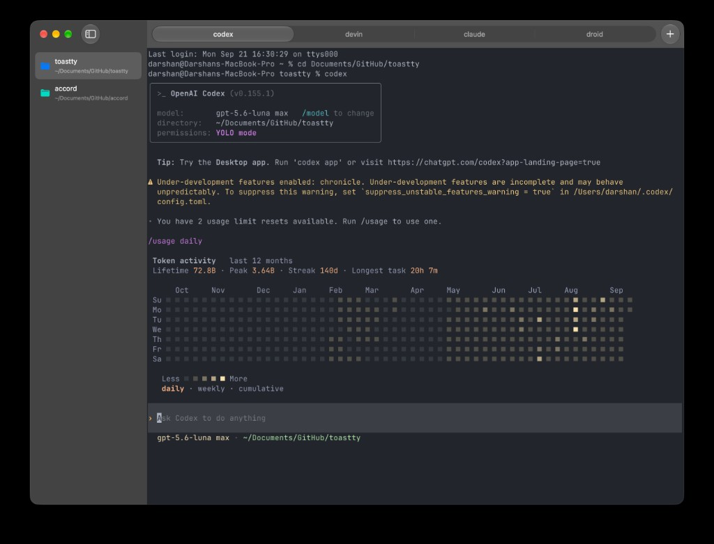
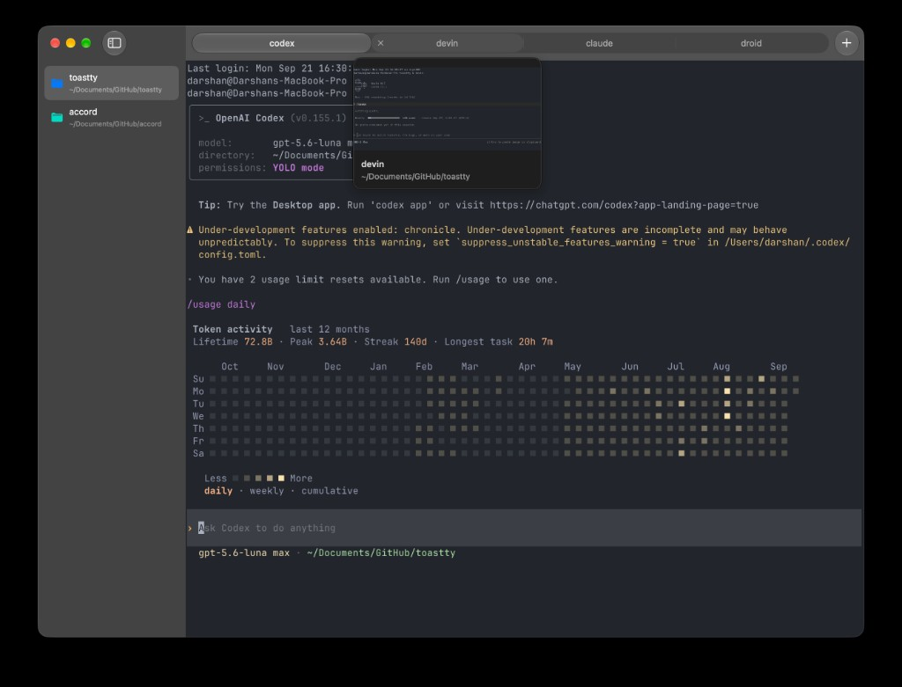
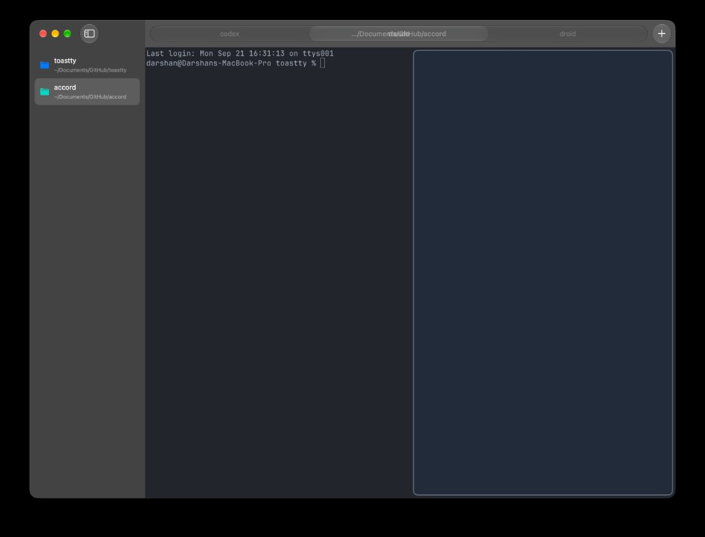
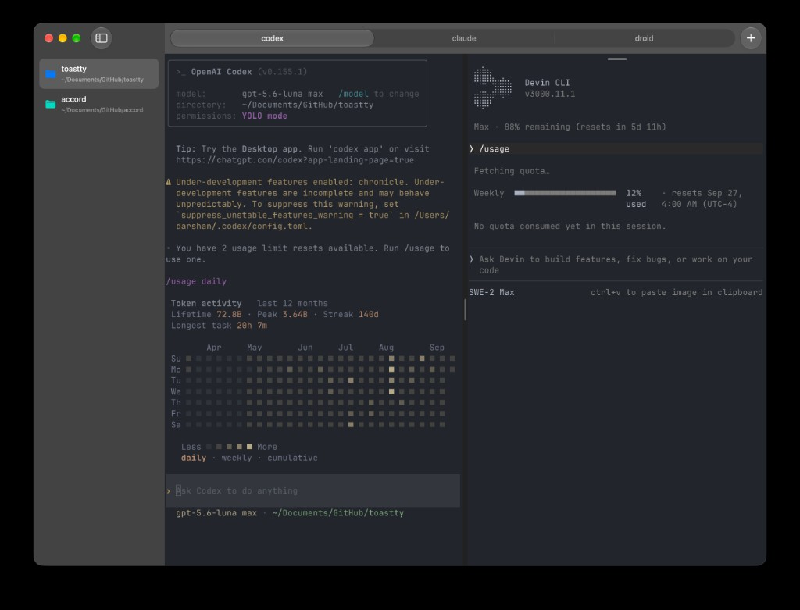
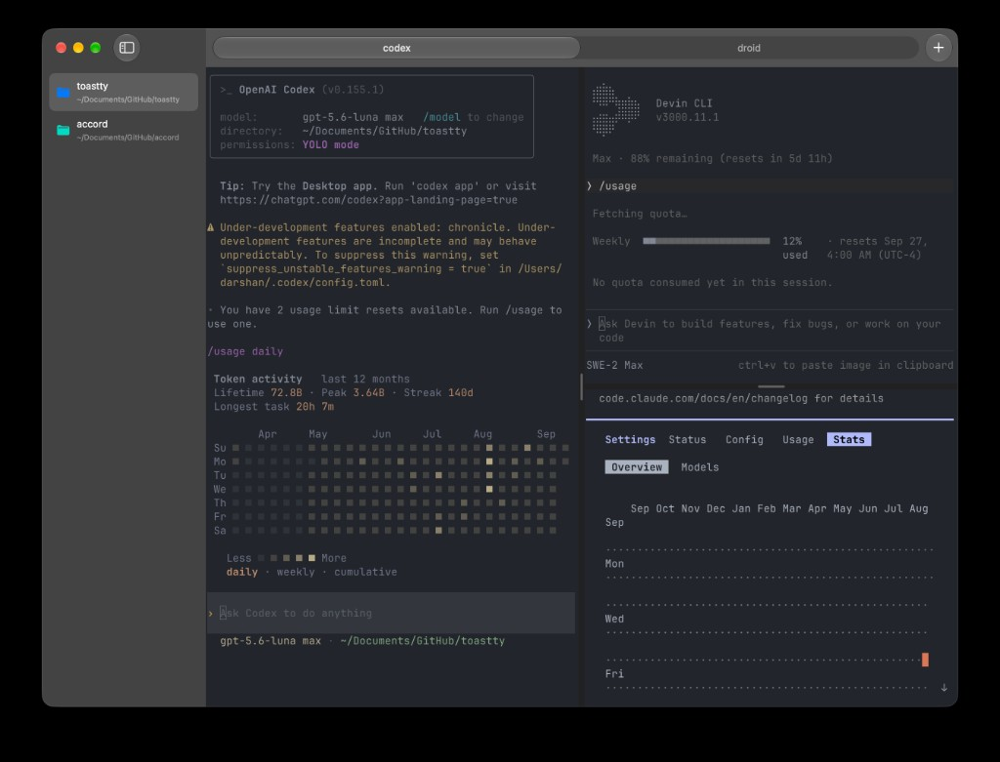
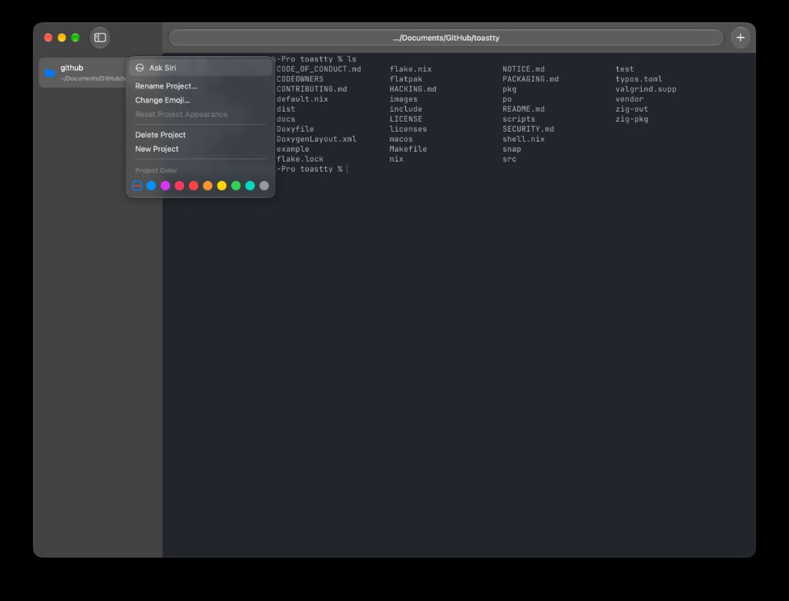
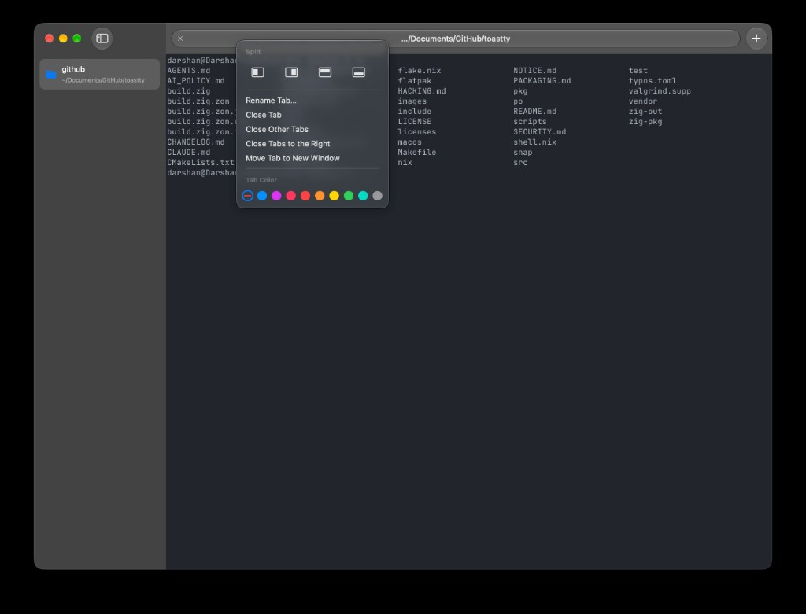

<p align="center">
  
</p>

<h1 align="center">Toastty</h1>

<p align="center">
  A macOS terminal with project workspaces, tabs, and split panes.
</p>

<p align="center">
  <a href="https://github.com/dar7an/toastty/releases/tag/nightly">Download</a>
  ·
  <a href="https://github.com/dar7an/toastty/issues">Issues</a>
  ·
  <a href="docs/usage.md">Usage</a>
  ·
  <a href="CONTRIBUTING.md">Contributing</a>
</p>

Toastty is an independent macOS fork of [Ghostty](https://ghostty.org). It builds
on Ghostty's terminal engine and adds project workspaces, tab previews, and
controls for arranging terminals. Each project keeps its own tabs, so you can
switch projects while their shells keep running.

## Get Toastty

Toastty is a development preview. Features and configuration may change.
The supported platform is macOS.

1. Download `Toastty-Nightly.zip` from the
   [Nightly release page](https://github.com/dar7an/toastty/releases/tag/nightly).
2. Extract the ZIP and move **Toastty Nightly.app** into **Applications**.
3. Open **Toastty Nightly**.

Nightly builds are ad-hoc signed, without Apple's Developer ID signing or
notarization. macOS may ask you to approve the app in **System Settings →
Privacy & Security** on first launch. A notarized stable release is not yet
available.

Nightly installs alongside Toastty and Ghostty. It has its own preferences and
saved windows, but shares terminal configuration files with other Toastty builds.
Older Toastty installations need this one-time Nightly download before they can
receive Nightly updates. See the [release guide](docs/releases.md#nightly-updates-without-notarization)
for details.

## See Toastty

<p align="center">
  
</p>

<p align="center">Projects, tabs, and panes stay together so you can move between contexts without losing your place.</p>

<p align="center">
  
</p>

<p align="center">Hover a tab to preview its terminal before switching.</p>

<p align="center">
  
  &nbsp;
  
</p>

<p align="center">
  
</p>

<p align="center">Split in four directions and nest panes when you need more than one session in view.</p>

<p align="center">
  
  &nbsp;
  
</p>

<p align="center">Right-click a project or tab to rename it, set a color, or rearrange the workspace.</p>

## Work with projects

Choose **File → New Project** or press **⌘P** to create a project using the current
terminal directory. Its name and path appear in the sidebar. Each project
remembers which tab you selected.

- **Rename a project:** double-click its name. This changes the sidebar label;
  it does not rename the folder or its files.
- **Choose a color or emoji:** right-click the project. Use **Reset Project
  Appearance** to return to its default appearance.
- **Delete a project:** right-click it and choose **Delete Project**, or swipe
  left on its sidebar row with a trackpad to reveal the delete action. This
  closes its terminals and removes the project from Toastty. Its files stay
  on disk. Toastty shows its usual confirmation for running processes.
- **Make room:** use the round sidebar button or **⌘B** to hide or show the
  sidebar. Drag the sidebar divider to change its width.

With window restoration enabled, Toastty restores your projects, tab order,
names, colors, and layout when you reopen it. Running programs do not resume.

## Preview and move tabs

Press **⌘T** or click **+** to add a tab to the current project. Right-click a tab
to rename it, assign a color, split its terminal, or close tabs.

- Hover over an inactive tab to preview its terminal and tab details without
  switching to it. The preview appears below the tab you are hovering over.
- Drag a tab along the tab bar to reorder it.
- Pull a tab away from the bar to turn it into a window you can move. Press
  **Escape** during the drag to cancel.
- Drop a tab onto an edge of a terminal area to create a split.
  Its terminal sessions keep running during the move.

## Arrange terminal panes

Right-click a terminal or tab and use **Split** to add a pane to the left,
right, above, or below. **Arrange Splits** lets you zoom one pane, restore the
full layout, or equalize pane sizes.

Hover at the top center of a pane to reveal its floating drag handle. Drag that
handle to another pane's edge to move the terminal there. An outline shows where
it will land. The handle stays hidden while you work elsewhere in the terminal.

Drag the dividers between panes to resize them. They have small grip indicators
and snap near one-third, one-half, and two-thirds of the available space. Hold
**Option** to resize without snapping, or double-click a divider to equalize
the panes.

## Choose an appearance

Toastty follows your Mac's appearance by default, using **Atom One Light** in
light mode and **Atom One Dark** in dark mode. The sidebar and rounded tab bar
use distinct background shades, with macOS window controls and a circular
sidebar button.

Choose **View → Appearance → System**, **Light**, or **Dark** to change appearance
without restarting. The choice applies to all windows, including Quick Terminal,
and is saved for the next launch. Custom themes and colors remain available in
the configuration file. See [appearance and themes](docs/usage.md#appearance-and-themes).

## Keyboard shortcuts

These are the default shortcuts. You can change them in the configuration file.

| Action | Shortcut |
| --- | --- |
| Create a project | <kbd>⌘P</kbd> |
| Create a tab | <kbd>⌘T</kbd> |
| Show or hide the sidebar | <kbd>⌘B</kbd> |
| Switch to the next project | <kbd>⌃⌘Tab</kbd> |
| Switch to the previous project | <kbd>⇧⌃⌘Tab</kbd> |
| Select a project by sidebar position | <kbd>⌥1</kbd>–<kbd>⌥9</kbd> |
| Open the command palette | <kbd>⇧⌘P</kbd> |

The command palette lets you search for actions by name. The
[usage guide](docs/usage.md) has more detail about projects, panes, and settings.

## Keep Nightly up to date

A new Nightly becomes available after its commit passes the automated checks on
`main` and the Nightly build is published.

Nightly uses Sparkle to verify and install updates. By default, it checks every
six hours and downloads updates in the background. It installs a prepared update
when you quit normally. To check sooner, choose **Check for Updates…** in the app
menu. The update window lets you download an update and choose **Install and
Relaunch**.

Background updates do not restart the app. Normal warnings about running
processes still apply when you quit. To check without automatic downloads, set
`auto-update = check`; to turn off background checks, set `auto-update = off`.
Manual checks remain available. The [release guide](docs/releases.md#nightly-updates-without-notarization)
explains the update choices and how to find your build number.

## Configuration

Open **Toastty → Settings** to edit the configuration file. Toastty reads
`~/.config/toastty/config` and
`~/Library/Application Support/com.dar7an.toastty/config`; when both files
exist, the Application Support file takes precedence.

Most [Ghostty configuration settings](https://ghostty.org/docs/config) remain
compatible. Toastty does not import Ghostty's configuration automatically, so
copy only the settings you want to use. The [configuration section of the usage
guide](docs/usage.md#configuration) explains the supported paths and theme
options.

## Build from source

You need macOS with Xcode 26 or later, Zig 0.16.0, Nushell, SwiftLint, Python 3,
and Git. Clone the repository and run the development build:

```sh
git clone https://github.com/dar7an/toastty.git
cd toastty
scripts/build.sh
open macos/build/Debug/Toastty.app
```

For an optimized local build, run `scripts/build.sh ReleaseLocal`. Both local
builds use separate app identities and stay under `macos/build/`, so they can run
alongside an installed Toastty or Nightly app. They do not receive Nightly updates.
See [Development](docs/development.md) for setup and testing instructions.

The inherited Linux source remains in the repository for upstream compatibility.
It is not a supported Toastty distribution.

## Contributing

Bug reports and contributions are welcome. Start with
[Contributing to Toastty](CONTRIBUTING.md) and [Development](docs/development.md).
Keep changes focused, preserve upstream credit, and add regression coverage for
behavioral changes.

The main checks are:

```sh
scripts/test.sh
zig build test -Dtest-filter='config.Config'
git diff --check
```

Visual changes should be checked in the running macOS app in both appearances,
at a narrow window size, and with keyboard accessibility in mind.

## Attribution and license

Toastty is an independent fork of [Ghostty](https://ghostty.org), not a terminal
engine written from scratch. It includes Ghostty's Zig terminal core, its
embedded [libghostty](https://mitchellh.com/writing/libghostty-is-coming) API,
rendering, shell integration, fonts and resources, and substantial Swift/AppKit
application code. These components were created by **Mitchell Hashimoto and the
Ghostty contributors**.

The original [MIT license](LICENSE) and copyright notice are retained. Toastty's
additions use the same license. The [attribution record](NOTICE.md) describes
the inherited components and required notices. The complete set of bundled
[third-party notices](macos/Sources/ThirdPartyNotices.txt) is also retained.
These files and the applicable source headers must accompany copies or
substantial portions of the software.

Toastty is maintained separately. It is not an official Ghostty release and is
not affiliated with or endorsed by Mitchell Hashimoto or the Ghostty project.
Please report Toastty-specific issues in
[dar7an/toastty](https://github.com/dar7an/toastty), not to the upstream
Ghostty maintainers.
