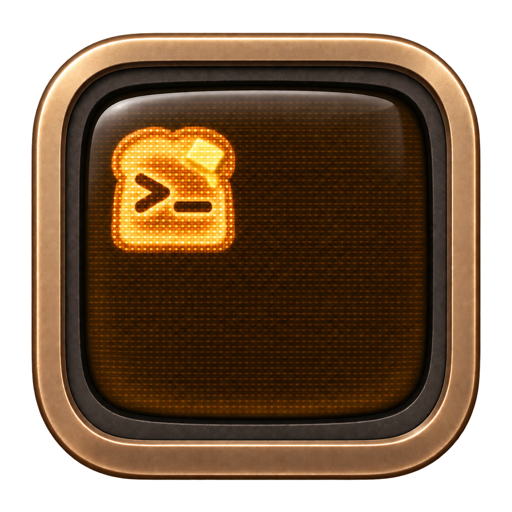
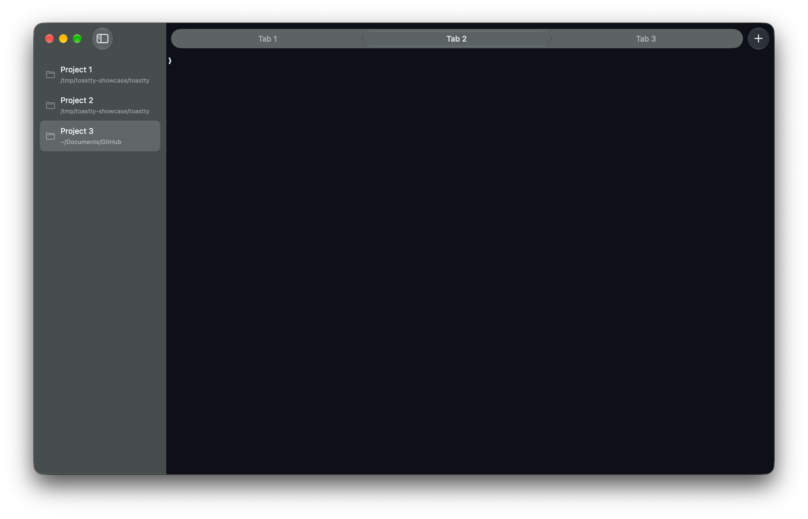

<p align="center">
  
</p>

<h1 align="center">Toastty</h1>

<p align="center">
  A native macOS terminal with a workspace for every project.
</p>

<p align="center">
  <a href="https://github.com/dar7an/toastty/releases/tag/nightly">Download</a>
  ·
  <a href="https://github.com/dar7an/toastty/issues">Issues</a>
  ·
  <a href="docs/usage.md">Usage</a>
  ·
  <a href="CONTRIBUTING.md">Contributing</a>
</p>

Toastty keeps terminal work together. Give each project its own workspace, tabs,
and panes, then move between projects without losing your place.

Toastty is an independent macOS fork of [Ghostty](https://ghostty.org). It
retains Ghostty's terminal foundation and adds a focused project workspace
around it. Toastty is built on Ghostty and [libghostty](https://mitchellh.com/writing/libghostty-is-coming);
the inherited work and its authors are documented in
[Attribution and notices](NOTICE.md).

## What Toastty provides

- **Project workspaces.** Each project keeps its own tabs and selected tab. The
  project directory is visible at a glance, and renaming a project does not
  rename the directory.
- **A native macOS layout.** Use a collapsible sidebar, a compact tab rail, and
  familiar macOS window controls in one focused workspace.
- **Terminal panes that stay out of the way.** Split in four directions, move
  panes with drag and drop, snap dividers into place, or zoom and equalize the
  layout when you need more room.
- **Appearance that follows your Mac.** Choose System, Light, or Dark and keep
  the terminal palette and window chrome in step. Custom themes remain
  available through the configuration file.
- **A separate identity from Ghostty.** Toastty has its own app identity,
  preferences, saved windows, and configuration, so both applications can run
  side by side.

## See Toastty

<p align="center">
  
</p>

The workspace layout stays clear as your projects and tabs grow.

## Project status

Toastty is a development preview, and its behavior and configuration may
change. CI publishes a preview `Toastty.dmg` from successful commits on `main`
as a [nightly prerelease](https://github.com/dar7an/toastty/releases/tag/nightly).
It is ad-hoc signed, without Developer ID signing or notarization, so Gatekeeper
may block it. A signed and notarized public release, automatic
updates, and a stable release channel are not configured yet. See
[release readiness](docs/releases.md) for the requirements before publishing a
release.

The supported Toastty target is macOS. The inherited Linux source remains in the
repository for upstream compatibility; it is not a supported Toastty
distribution.

## Build from source

Toastty currently requires:

- macOS with Xcode 26 or later
- Zig 0.16.0
- Nushell
- SwiftLint
- Python 3
- Git

Clone the repository and run the development build:

```sh
git clone https://github.com/dar7an/toastty.git
cd toastty
scripts/build.sh
open macos/build/Debug/Toastty.app
```

For an optimized local build, run `scripts/build.sh ReleaseLocal`. It is signed
for local use, but it is not a notarized public release.

## Start using Toastty

| Action | Shortcut |
| --- | --- |
| Create a project | <kbd>⌘P</kbd> |
| Create a tab | <kbd>⌘T</kbd> |
| Show or hide the sidebar | <kbd>⌘B</kbd> |
| Switch to the next project | <kbd>⌃⌘Tab</kbd> |
| Switch to the previous project | <kbd>⇧⌃⌘Tab</kbd> |

Create a project from the current terminal directory with **File → New Project**.
Use a terminal or tab context menu to split and arrange panes. Read the
[usage guide](docs/usage.md) for projects, panes, appearance, themes, and
configuration.

## Configuration

Open **Toastty → Settings** to edit the configuration file. Toastty reads
`~/.config/toastty/config` and
`~/Library/Application Support/com.dar7an.toastty/config`; when both files
exist, the Application Support file takes precedence.

Most [Ghostty configuration settings](https://ghostty.org/docs/config) remain
compatible. Toastty does not import Ghostty's configuration automatically, so
copy only the settings you want to use. The [configuration section of the usage
guide](docs/usage.md#configuration) explains the supported paths and theme
options.

## Contributing

Start with [Contributing to Toastty](CONTRIBUTING.md) and
[Development](docs/development.md). Keep changes focused, preserve upstream
credit, and add regression coverage for behavioral changes.

The main checks are:

```sh
scripts/test.sh
zig build test -Dtest-filter='config.Config'
git diff --check
```

Visual changes should be checked in the running macOS app in both appearances,
at a narrow window size, and with keyboard accessibility in mind.

## Attribution and license

Toastty is an independent fork of [Ghostty](https://ghostty.org), not a terminal
engine written from scratch. It includes Ghostty's Zig terminal core, its
embedded [libghostty](https://mitchellh.com/writing/libghostty-is-coming) API,
rendering, shell integration, fonts and resources, and substantial Swift/AppKit
application code. These components were created by **Mitchell Hashimoto and the
Ghostty contributors**.

The original [MIT license](LICENSE) and copyright notice are retained. Toastty's
additions use the same license. The [attribution record](NOTICE.md) describes
the inherited components and required notices. The complete set of bundled
[third-party notices](macos/Sources/ThirdPartyNotices.txt) is also retained.
These files and the applicable source headers must accompany copies or
substantial portions of the software.

Toastty is maintained separately. It is not an official Ghostty release and is
not affiliated with or endorsed by Mitchell Hashimoto or the Ghostty project.
Please report Toastty-specific issues in
[dar7an/toastty](https://github.com/dar7an/toastty), not to the upstream
Ghostty maintainers.
